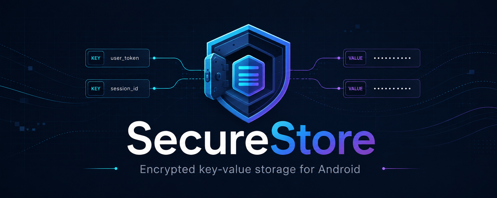

# SecureStore



SecureStore is a Kotlin-first encrypted key-value library for Android. It automatically serializes,
encrypts, stores, decrypts, and decodes small values through a coroutine-friendly API.

- Values use AES-256-GCM with keys held by Android Keystore.
- Logical identifiers use HMAC-SHA-256 obfuscation by default.
- Storage is isolated by application package and namespace.
- The library has no telemetry, network calls, or network permission.

> The API `key` is a logical identifier, not a cryptographic key. In the default configuration it
> is HMAC-obfuscated rather than reversibly encrypted. Both the original identifier and plaintext
> value are absent from persistent storage managed by SecureStore.

## Status

This project is under active development and is not yet recommended for production or
security-critical data. The current minimum Android version is API 23.

## Installation

### Requirements

- Android API 23 (Android 6.0) or newer
- Kotlin with coroutine support
- Java 17 toolchain when building the library from source

SecureStore is built by [JitPack](https://jitpack.io/) from this repository, so maintainers do not
need to upload artifacts to GitHub Packages. Add JitPack to the consuming project's
`settings.gradle.kts`:

```kotlin
dependencyResolutionManagement {
    repositories {
        google()
        mavenCentral()
        maven(url = "https://jitpack.io")
    }
}
```

Then add the library dependency. Replace `<version>` with a Git tag, commit hash, or branch
snapshot. JitPack builds the selected revision on demand; no credentials are required.

```kotlin
dependencies {
    implementation("com.github.jevhee:secure-store:<version>")
}
```

The [JitPack build page](https://jitpack.io/#jevhee/secure-store) shows the available versions and
the exact dependency coordinate for each revision.

## Usage

All SecureStore operations that access data are `suspend` functions. Open a store once for a
stable namespace, then use it from a coroutine such as a ViewModel's `viewModelScope`.

### Open a store

```kotlin
import io.github.jevhee.securestore.SecureStore
import io.github.jevhee.securestore.SecureStoreResult

val secureStore = SecureStore.open(
    context = applicationContext,
    namespace = "authentication",
)
```

The namespace separates data within the same application. It must be stable: changing it creates
a different store. Omit `namespace` to use `SecureStore.DEFAULT_NAMESPACE` (`"default"`).

### Write and read a value

```kotlin
import io.github.jevhee.securestore.SecureStoreResult

when (val result = secureStore.put("access_token", token)) {
    is SecureStoreResult.Success -> Unit
    is SecureStoreResult.Failure -> handleSecureStorageFailure(result.error)
}

val storedToken: String? = when (val result = secureStore.getString("access_token")) {
    is SecureStoreResult.Success -> result.value
    is SecureStoreResult.Failure -> null // Apply an explicit recovery policy.
}
```

`Success(null)` means the entry does not exist. A read with a getter that does not match the
stored type returns `Failure(TypeMismatch)` rather than converting the value.

### Supported values and entry management

Supported values are `String`, `Int`, `Long`, `Float`, `Double`, `Boolean`, and
`ByteArray`. Use the matching getter for each value; binary values use `getBytes`.

```kotlin
when (val exists = secureStore.contains("access_token")) {
    is SecureStoreResult.Success -> if (exists.value) {
        secureStore.remove("access_token")
    }
    is SecureStoreResult.Failure -> handleSecureStorageFailure(exists.error)
}

// Removes every application value in the namespace, while retaining internal key metadata.
when (val result = secureStore.clear()) {
    is SecureStoreResult.Success -> Unit
    is SecureStoreResult.Failure -> handleSecureStorageFailure(result.error)
}
```

`remove` and `clear` remove entries from the store, but do not guarantee physical erasure from
flash storage. Values are limited to 1 MiB before encryption, and logical keys are limited to
256 UTF-8 bytes.

### Handle failures explicitly

Every operation returns `SecureStoreResult`, keeping storage and cryptographic failures visible to
the caller. Decide the recovery behavior appropriate for the data being protected:

```kotlin
when (val result = secureStore.getString("access_token")) {
    is SecureStoreResult.Success -> useToken(result.value)
    is SecureStoreResult.Failure -> when (result.error) {
        SecureStoreError.AuthenticationRequired -> promptForDeviceAuthentication()
        SecureStoreError.KeyInvalidated,
        SecureStoreError.KeyNotFound -> signOutAndRequireSignIn()
        SecureStoreError.CorruptedData,
        SecureStoreError.IntegrityCheckFailed -> discardAffectedSession()
        else -> showRecoverableStorageError()
    }
}
```

Import `io.github.jevhee.securestore.SecureStoreError` for the error categories above. Never
silently treat every failure as a missing value: loss of a Keystore key and unauthenticated or
corrupt data may require a different recovery path.

## Configuration

Defaults use the supported AES-256-GCM profile, obfuscated identifiers, lazy migration, and
explicit failures for corrupt data:

```kotlin
import io.github.jevhee.securestore.IdentifierProtection
import io.github.jevhee.securestore.MigrationPolicy
import io.github.jevhee.securestore.SecureStoreConfig

val secureStore = SecureStore.open(
    context = applicationContext,
    namespace = "authentication",
    config = SecureStoreConfig(
        identifierProtection = IdentifierProtection.Obfuscated,
        migrationPolicy = MigrationPolicy.Lazy,
    ),
)
```

`IdentifierProtection.Plain` stores logical identifiers as visible metadata and should only be
selected when that disclosure is acceptable. A namespace cannot be reopened with a different
configuration in the same application process.

Rotate the active value-encryption key with `rotateKey()`. With lazy migration, entries encrypted
by an older key are rewritten only after a successful read. Explicit `migrate()` is available for
plain identifiers; obfuscated identifiers cannot currently be enumerated back to their logical
keys and are reported as skipped.

```kotlin
when (val rotation = secureStore.rotateKey()) {
    is SecureStoreResult.Success -> logKeyVersion(rotation.value.activeVersion)
    is SecureStoreResult.Failure -> handleSecureStorageFailure(rotation.error)
}

when (val migration = secureStore.migrate()) {
    is SecureStoreResult.Success -> logMigration(migration.value)
    is SecureStoreResult.Failure -> handleSecureStorageFailure(migration.error)
}
```

Keep a namespace's configuration consistent. Reopening the same namespace with a different
configuration in the same application process throws `IllegalArgumentException`.

## Security boundary

SecureStore protects data at rest written by this library. It does not protect plaintext already in
application memory, an application process under attacker control, or a compromised device.
Secure physical deletion on flash storage cannot be guaranteed.

SecureStore uses the `SST1` envelope and `securestore` internal identifiers.

Android Keystore keys are device-local. Host applications must define backup and device-transfer
rules that exclude SecureStore storage; restoring ciphertext without its Keystore key makes the data
unreadable. Multi-process access is not supported.

## License

Copyright 2026 jevhee.

SecureStore is available under the [Apache License 2.0](LICENSE).
